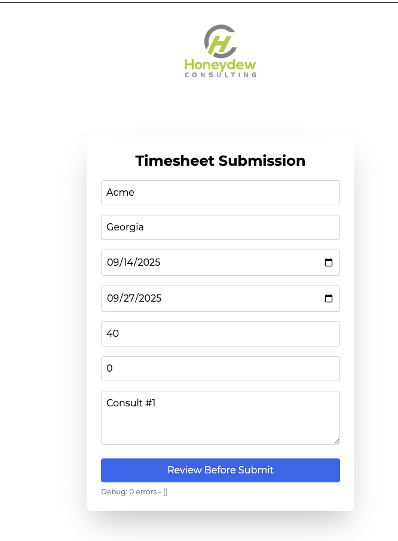
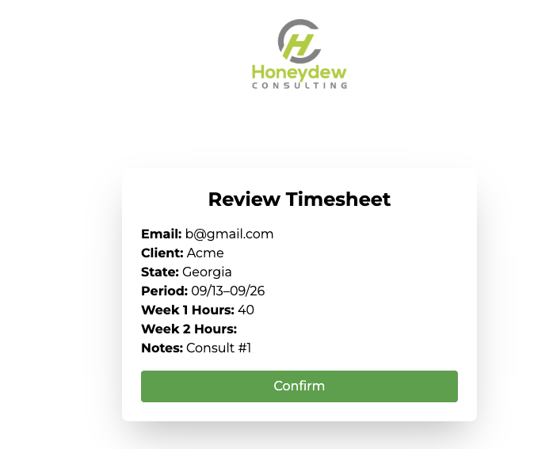
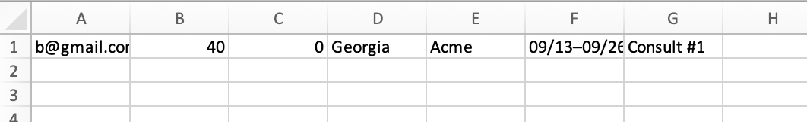
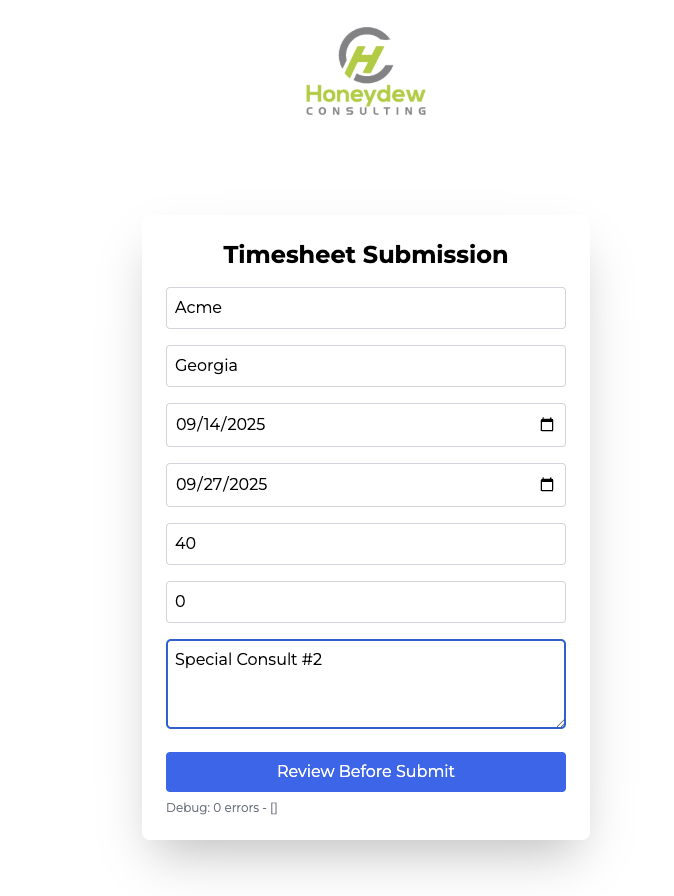
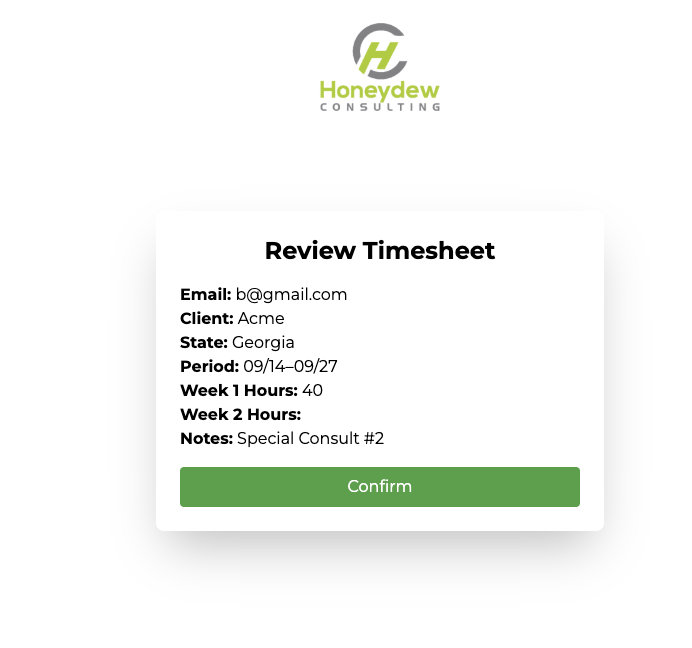
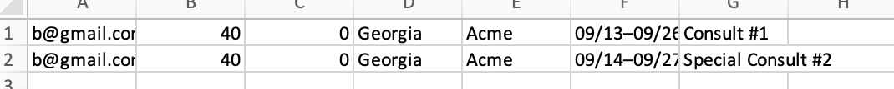

# Frontend QA Test Matrix - Timesheet Validation

## Test Environment
- **Branch**: `mapping-validation`
- **Directory**: `frontend/`
- **Command**: `cd frontend && npm install && npm start`
- **URL**: `http://localhost:3000/timesheet`
- **User**: John (default from Header)
- **Backend**: Running locally (`cd ../backend && npm start`)

## Test Execution Status
- **Total Tests**: 19
- **Passed**: 0
- **Failed**: 0
- **Blocked**: 0
- **Status**: ☐ Not Started | ☐ In Progress | ☑️ Completed

---

## Core Validation Tests

| Test ID  | Test Case Steps  | Expected Result | Pass/Fail | Screenshot |

| Test ID  | Test Case           | Steps (Inputs)                                                                                                                                                                                                                                | Expected Result                                                                                                                                                                                                                                                                                  | Pass/Fail | Notes                  | Screenshot                            |
| -------- | ------------------- | --------------------------------------------------------------------------------------------------------------------------------------------------------------------------------------------------------------------------------------------- | ------------------------------------------------------------------------------------------------------------------------------------------------------------------------------------------------------------------------------------------------------------------------------------------------ | --------- | ---------------------- | ------------------------------------- |
| **S001** | Sample QA (Acme/GA) | 1. Navigate to `http://localhost:3000/timesheet`<br>2. From: `2025-09-14`<br>3. To: `2025-09-27`<br>4. Week 1: `40`<br>5. Week 2: `0`<br>6. Client: `Acme`<br>7. State: `GA`<br>8. Click "Review Before Submit"<br>9. Click "Export to Excel" | ✅ Navigates to `/review`<br>✅ Review shows correct data<br>✅ Downloads `timesheet.xlsx`<br>✅ Excel: Email (`john@example.com`), Week 1 (`40.00`), Week 2 (`0.00`), State (`GA`), Client (`Acme`), Pay Period (`09/14–09/27`), Notes (empty)<br>✅ Backend logs 201 Created<br>✅ No console errors | ☐         | Run and mark Pass/Fail | `screenshots/test-sample-qa.xlsx.png` |
| **S001 Results** |Expected Result for Columns A-G ✅ | Note: The date is incorrect, working on fix. |



*********Screenshots with fixed date bug********





## Core Validation Tests

| **T001** | Decimals accepted   | 1. Navigate to `/timesheet`<br>2. Week 1: `18.5`<br>3. Week 2: `0`<br>4. Client: "Client 1"<br>5. State: "California"<br>6. Click "Review Before Submit"        | ✅ Accepts decimals<br>✅ Navigates to `/review`<br>✅ Review shows "Week 1 Hours Worked: 18.5"                                                | ☐         | Total = 18.5 ≤ 168    |
| **T001 results** | Decimals accepted | ... | Expected Result | ✅ | Total = 18.5 ≤ 168 |  |


| **T002** | Weekly cap (Week 1) | 1. Navigate to `/timesheet`<br>2. Week 1: `101`<br>3. Week 2: `0`<br>4. Client: "Client 1"<br>5. State: "California"<br>6. Click "Review Before Submit"         | ❌ **Week 1 field** red error: "Week 1 Hours cannot exceed 100 hours."<br>❌ Form blocked (no navigation)<br>✅ No Week 2 error                | ☐         | 100hr/week cap|
| **T002 results** | Weekly cap (Week 1) | Week 1: '101' | Expected Result | ✅ | "Value must be less or equal to 100."|  |


| **T003** | Weekly cap (Week 2) | 1. Navigate to `/timesheet`<br>2. Week 1: `0`<br>3. Week 2: `101.25`<br>4. Client: "Client 1"<br>5. State: "California"<br>6. Click "Review Before Submit"      | ❌ **Week 2 field** red error: "Week 2 Hours cannot exceed 100 hours."<br>❌ Form blocked<br>✅ No Week 1 error                                | ☐         | 100hr/week cap        |
| **T003 results** | Weekly cap (Week 2) | Week 2: '101.25'| Expected Result | ✅ "Value must be less than or equal to 100." |  |


| **T004** | Period cap          | 1. Navigate to `/timesheet`<br>2. Week 1: `100`<br>3. Week 2: `69`<br>4. Client: "Client 1"<br>5. State: "California"<br>6. Click "Review Before Submit"        | ❌ **Bottom of form** red error: "Pay Period hours entered exceeded the allowable amount."<br>❌ Form blocked<br>✅ No individual week errors  | ☐         | Total = 169 > 168     |
| **T004 results** | Week 1: '100' | Week 2: '69' | Expected Result | ✅ | Form blocked |  |


| **T005** | Decimal > 2 places  | 1. Navigate to `/timesheet`<br>2. Week 1: `45.123`<br>3. Week 2: `35.456`<br>4. Client: "Client 1"<br>5. State: "California"<br>6. Click "Review Before Submit" | ❌ **Week 1 field** red error: "Please enter a valid number with up to 2 decimal places."<br>❌ **Week 2 field** same error<br>❌ Form blocked | ☐         | Both have 3+ decimals |
| **T005 results** | Week 1: `45.123` | Week 2: `35.456` | Expected Result | ✅ | Form blocked, "Please enter a valid value. The two nearest valid valuyes are 45.12 and 45.13." |  |


| **T006 results** | Missing Client | Expected Result | ✅ | Message: Validation failed - stopping submission |  |


| **T007** | Missing State  | 1. Navigate to `/timesheet`<br>2. Valid dates<br>3. Week 1: `40`<br>4. Week 2: `35`<br>5. Client: "Client 1"<br>6. **State**: blank<br>7. Click "Review Before Submit"                                      | ❌ **State field** red error: "Please select a state."<br>❌ Form blocked<br>✅ No other errors                                          | ☐         | State required       |
| **T007 results** | Missing State | Expected Result | ✅ | Message: Validation failed - stopping submission |  |


| **T008** | Missing Dates  | 1. Navigate to `/timesheet`<br>2. **Leave From blank**<br>3. **Leave To blank**<br>4. Week 1: `40`<br>5. Week 2: `35`<br>6. Client: "Client 1"<br>7. State: "California"<br>8. Click "Review Before Submit" | ❌ **From field** red error: "Please select a start date."<br>❌ **To field** red error: "Please select an end date."<br>❌ Form blocked | ☐         | Date fields required |
| **T008 results** | Missing Dates | Expected Result | ✅ | Message: Validation failed - stopping submission |  |


| **T009** | Maximum valid values      | 1. Navigate to `/timesheet`<br>2. Week 1: `100.00`<br>3. Week 2: `68.00`<br>4. Client: "Client 1"<br>5. State: "California"<br>6. Click "Review Before Submit" | ✅ No errors (Total = 168.00)<br>✅ Navigates to Review                                        | ☐         | Boundary test        |            |
| **T009 results** | Max valid values | Week 1: `100.00 | Week 2: `68.00` | Expected Result | ✅ | ✅ Validation passed - proceeding with submission |  |


| **T010** | Zero hours                | 1. Navigate to `/timesheet`<br>2. Week 1: `0`<br>3. Week 2: `0`<br>4. Client: "Client 1"<br>5. State: "California"<br>6. Click "Review Before Submit"          | ✅ No errors<br>✅ Navigates to Review<br>✅ Review shows "0" for both weeks                    | ☐         | Minimum valid values |
| **T018 results** | Zero hours | Week 1: `0` | Week 2: `0` | Expected Result | ✅ | ✅ Validation passed - proceeding with submission |  |


---
## Execution Instructions

### **Frontend Setup**
```bash
cd frontend
npm install
npm start
# Backend in separate terminal:
cd ../backend
npm install
npm start
